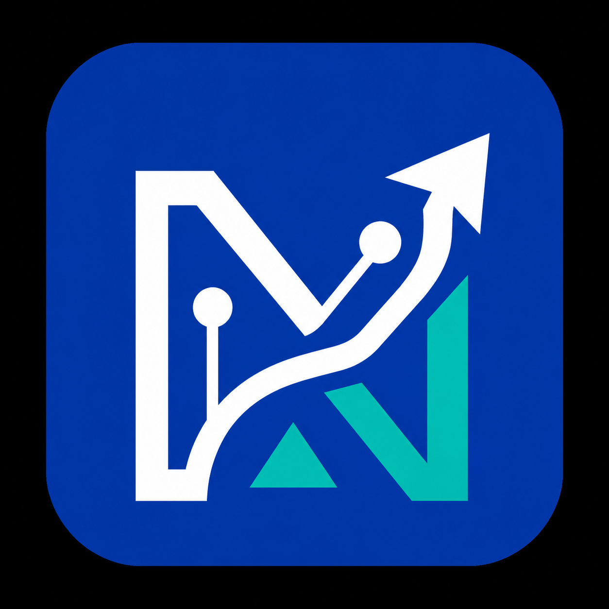

# NextHire — AI Recruiter Agent 🤖

> **Global AI Hackathon Series with Qwen Cloud** | Alibaba Cloud + Devpost  
> **Track 4 — Autopilot Agent**

An autonomous AI-powered recruiter agent that manages the complete hiring lifecycle — from resume upload to interview scheduling. Built with **Qwen Cloud** for advanced AI reasoning, NextHire acts as an AI employee assisting HR teams, not just a chatbot.



---

## 🎯 Problem Statement

Traditional recruitment is manual, time-consuming, and prone to bias. HR teams spend hours screening resumes, scheduling interviews, and making decisions that could be automated with AI reasoning.

## 💡 Solution

**NextHire AI Recruiter Agent** is an autonomous autopilot agent that:
- **Understands** candidate resumes and job descriptions using Qwen AI
- **Reasons** about candidate-job fit through multi-agent evaluation
- **Invokes tools** autonomously (resume parser, skill extractor, scorer, email generator)
- **Makes decisions** based on AI analysis and recruiter preferences
- **Requests human approval** before critical actions (offers, rejections, scheduling)
- **Continues execution** after approval, completing the workflow end-to-end
- **Remembers** recruiter preferences and candidate history across sessions

---

## 🏗️ Architecture

```
Candidate → Resume Upload → NextHire AI Agent
                                    │
                    ┌───────────────┼───────────────┐
                    │               │               │
                    ▼               ▼               ▼
              Qwen Cloud      MongoDB/SQL      Email Service
              (AI Reasoning)  (Persistence)    (Notifications)
                    │
                    ▼
            ┌─────────────────────────────────┐
            │     Autonomous Agent Pipeline     │
            ├─────────────────────────────────┤
            │ 1. Resume Parser Tool            │
            │ 2. Skill Extractor Tool          │
            │ 3. JD Matcher Tool               │
            │ 4. Candidate Scorer Tool         │
            │ 5. Interview Generator Tool      │
            │ 6. AI Reasoning (Qwen)           │
            │ 7. → APPROVAL GATE ←             │
            │ 8. Email Generator Tool          │
            │ 9. Calendar Scheduler Tool       │
            │ 10. Memory Store                 │
            └─────────────────────────────────┘
```

## 🤖 Autopilot Agent Workflow

```
Candidate Upload Resume
        │
        ▼
  Resume Parser (Tool)
        │
        ▼
  Qwen AI Analysis (Reasoning)
        │
        ▼
  Skill Extraction (Tool)
        │
        ▼
  Job Description Matching (Tool)
        │
        ▼
  Candidate Scoring (Tool)
        │
        ▼
  AI Decision Making (Qwen Reasoning)
        │
        ▼
  ┌─────────────────────────┐
  │  HUMAN-IN-THE-LOOP      │
  │  Recruiter Approval      │
  │  • Shortlist Candidate   │
  │  • Send Offer Letter     │
  │  • Reject Candidate      │
  │  • Schedule Interview    │
  │  • Send Email            │
  └─────────────────────────┘
        │ (After Approval)
        ▼
  Interview Question Generator (Tool)
        │
        ▼
  Email Generation (Tool)
        │
        ▼
  Calendar Scheduling (Tool)
        │
        ▼
  Persistent Memory Update
        │
        ▼
  Candidate Dashboard Updated ✓
```

---

## ✨ Features

### AI Capabilities (Powered by Qwen Cloud)
- 🧠 Resume intelligence & ATS scoring
- 🎯 Job description matching with skill gap analysis
- 🎤 Adaptive interview question generation
- 📊 Multi-agent hiring committee (War Room)
- 💡 Career coaching & learning roadmaps
- 🤖 AI Copilot assistant
- 📧 Email automation (offer, rejection, follow-up)

### Autopilot Agent Features
- 🔄 **Autonomous Workflow** — End-to-end hiring pipeline without manual steps
- 🛠️ **Tool Calling** — Agent invokes 10+ tools autonomously
- 🧠 **Persistent Memory** — Remembers preferences & candidate history across sessions
- ✅ **Human-in-the-Loop** — Critical actions require recruiter approval
- 📈 **AI Reasoning** — Qwen-powered decision making with confidence scores
- 📋 **Audit Trail** — Every tool invocation logged for transparency

### Platform Features
- 👥 Role-based auth (Recruiter, Candidate, Admin)
- 📱 Responsive design with dark mode
- 📊 Analytics dashboard with hiring funnel visualization
- 🏆 Gamification system with achievements
- 🔔 Real-time notifications via WebSocket
- 🎨 Modern glassmorphism UI with Framer Motion animations

---

## 🛠️ Tech Stack

| Layer | Technology |
|-------|-----------|
| **AI** | Qwen Cloud (Alibaba Cloud DashScope) via OpenAI SDK |
| **Model** | qwen-plus / qwen-turbo |
| **Frontend** | Next.js 16, React 19, TypeScript, Tailwind CSS v4 |
| **UI** | Glassmorphism, Framer Motion, Recharts, Lucide Icons |
| **Backend** | FastAPI (Python), async/await, modular architecture |
| **Database** | SQLite (dev) / PostgreSQL (prod) via SQLAlchemy 2.0 |
| **Auth** | JWT + Firebase Auth (Google Login) |
| **Real-time** | WebSocket via FastAPI |
| **Deployment** | Vercel (frontend) + Alibaba Cloud ECS (backend) |

---

## 🚀 Installation

### Prerequisites
- Node.js 18+
- Python 3.11+
- Qwen Cloud API Key ([Get one here](https://dashscope.console.aliyun.com/))

### 1. Clone Repository
```bash
git clone https://github.com/your-username/NextHire-Qwen.git
cd NextHire-Qwen
```

### 2. Frontend Setup
```bash
npm install
npm run dev
```

### 3. Backend Setup
```bash
cd backend
pip install -r requirements.txt
cp .env.example .env
# Edit .env and add your DASHSCOPE_API_KEY
python -m uvicorn app.main:app --reload --port 8001
```

---

## 🔐 Environment Variables

### Backend (`backend/.env`)
```env
# Qwen Cloud API Key (required)
DASHSCOPE_API_KEY=sk-xxxxxxxxxxxxxxxxxxxxxxxx

# Database
DATABASE_URL=sqlite+aiosqlite:///./nexthire.db

# JWT
JWT_SECRET=your-secret-key-here
JWT_ALGORITHM=HS256
ACCESS_TOKEN_EXPIRE_MINUTES=1440

# Server
BACKEND_PORT=8001
FRONTEND_URL=http://localhost:3000
```

### Frontend (`.env.local`)
```env
NEXT_PUBLIC_API_URL=http://localhost:8001
```

---

## 📡 API Documentation

Once the backend is running, visit:
- **Swagger UI**: http://localhost:8001/docs
- **ReDoc**: http://localhost:8001/redoc

### Key Autopilot Endpoints
| Method | Endpoint | Description |
|--------|----------|-------------|
| GET | `/api/autopilot/status` | Agent status & capabilities |
| GET | `/api/autopilot/tools` | List available agent tools |
| POST | `/api/autopilot/workflow` | Execute full autopilot workflow |
| GET | `/api/autopilot/approvals` | List pending approvals |
| POST | `/api/autopilot/approvals/resolve` | Approve/reject an action |
| POST | `/api/autopilot/memory` | Store recruiter preference |
| GET | `/api/autopilot/memory` | Retrieve stored memories |

---

## 🧠 AI Agent Architecture

### Multi-Agent System
NextHire uses multiple specialized AI agents, all powered by Qwen Cloud:

| Agent | Role |
|-------|------|
| Resume Intelligence | Deep resume parsing & scoring |
| JD Intelligence | Job description analysis |
| Interview Planner | Creates adaptive interview blueprints |
| Adaptive Interview | Generates context-aware questions |
| Technical Evaluation | Evaluates answers with precision |
| Difficulty Controller | Adjusts question difficulty dynamically |
| Hiring Manager | Makes final hiring decisions |
| War Room | Multi-evaluator committee simulation |
| Career Coach | Personalized learning roadmaps |
| Skill Gap Analyzer | Identifies missing skills |
| AI Copilot | Persistent assistant for candidates |

### Persistent Memory
The agent remembers:
- Recruiter preferences (e.g., "prefers React developers", "min 2 years experience")
- Candidate history (previous interviews, feedback, scores)
- Session context for continuity across interactions

### Tool Calling
The agent autonomously invokes tools in sequence:
```
Agent → resume_parser → skill_extractor → jd_matcher → candidate_scorer
      → qwen_reasoning → [APPROVAL GATE] → email_generator → calendar_scheduler
```

---

## 🚢 Deployment

### Frontend → Vercel
```bash
npm run build
# Deploy to Vercel via CLI or GitHub integration
```

### Backend → Alibaba Cloud ECS
```bash
docker build -t nexthire-backend .
# Deploy to ECS instance
docker run -d -p 8001:8001 --env-file .env nexthire-backend
```

### Database → PostgreSQL (Alibaba Cloud RDS or Railway)
Set `DATABASE_URL` to your PostgreSQL connection string.

---

## 🔮 Future Scope

- Video interview analysis with Qwen VL
- Multi-language support
- Advanced calendar integration (Google Calendar, Outlook)
- Slack/Teams notifications
- Batch candidate processing
- AI-powered salary negotiation assistant
- Diversity & inclusion scoring

---

## 👥 Contributors

- Built for the **Global AI Hackathon Series with Qwen Cloud** (Alibaba Cloud + Devpost)

---

## 📄 License

MIT License — see [LICENSE](LICENSE) for details.
